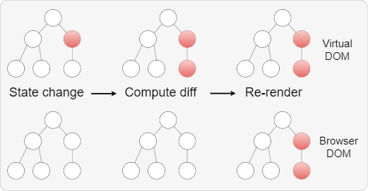
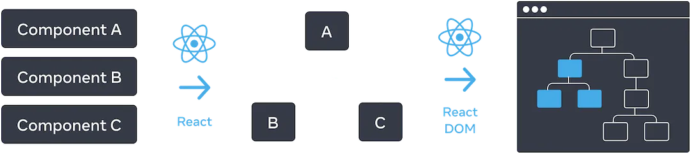

# Rendering Elements

📚 Table of Contents

- [Elements - the Smallest Building Blocks of React Applications](#elements---the-smallest-building-blocks-of-react-applications)
- [Updating Rendered Element](#updating-rendered-element)
- [Virtual DOM](#virtual-dom)
- [React UI Tree](#react-ui-tree)

### Elements - the Smallest Building Blocks of React Applications

An element describes what you want to see on the screen:

```jsx
const element = <h1>Hello, world</h1>;
```

Unlike browser DOM elements, React elements are plain JavaScript objects. \`React DOM\` takes care of updating the DOM to match the React elements.

The \`react-dom/client\` API interfaces allow rendering React components on the client (which run in the browser DOM environment). These APIs are typically used at the top level of your application to initialize your React tree.

Suppose you have a \`<div>\` in your HTML file:

```jsx
<div id="root"></div>
```

We call it the "root" DOM node because everything inside it will be managed by \`React DOM\`.

To render a React element into the root DOM node, you first need to create a ReactDOMRoot object for rendering the component inside the browser DOM:

```js
const root = ReactDOM.createRoot(domNode, options ?);
```

The \`ReactDOM.createRoot()\` method returns an object of type \`Root\`:

```ts
export interface Root {
  render(children: React.ReactNode): void;
  unmount(): void;
}
```

Which contains the \`render()\` method to render part of a \`JSX\` element (\`React node\`) inside the browser DOM node:

```js
import { createRoot } from 'react-dom/client';

const root = createRoot(document.getElementById('root'));

root.render(<h1>Hello, React!</h1>);
```

**[⬆ Back to Top](#rendering-elements)**

### Updating Rendered Element

React elements are immutable. Once you create an element, you cannot change its children or attributes. An element is like a single frame in a movie: it represents the UI at a certain point in time.

The only way to update the UI is to create a new element and pass it to the \`render()\` method.

```jsx
import { createRoot } from 'react-dom/client';

const root = createRoot(document.getElementById('root'));

const tick = () => {
  const element = (
    <div>
      <h1>Hello, world!</h1>
      <h2>It is {new Date().toLocaleTimeString()}.</h2>
    </div>
  );

  root.render(element);
};

setInterval(tick, 1000);
```

React DOM compares the element and its children with the previous ones and applies only the DOM updates necessary to bring the DOM to the desired state.

Although we create an element describing the entire UI tree on each tick, only the text node whose content has changed is updated in the React DOM.


### Virtual DOM

Virtual DOM is a concept used in JavaScript frameworks and libraries.

The main idea of Virtual DOM is that the browser representation of a web page is represented as an object tree (DOM), and any change in this tree can lead to the re-rendering of the entire page view.



The Virtual DOM is a JavaScript-based abstraction that represents a copy of the real DOM in memory. When the application state changes, the virtual DOM is compared with the old state, the difference is computed, and only the changes that need to be made to the real DOM are applied. This significantly reduces the number of element redraws on the page, often speeding up page rendering and improving application performance.

Additional Information:

- 🔗 [React Fiber Architecture (2016)](https://github.com/acdlite/react-fiber-architecture)
- 🔗 [React - Basic Theoretical Concepts (2016)](https://github.com/reactjs/react-basic)

**[⬆ Back to Top](#rendering-elements)**

### React UI Tree

React uses tree structures to manage and model the user interface you create. React creates a \`UI tree\` from your JSX. Then React DOM updates browser DOM elements to match this \`UI tree\`.



To compare the tree of elements, React implements a heuristic O(n) algorithm based on two assumptions:

- Different types of components are assumed to generate significantly different trees. React will not attempt to compare them but will simply replace the old tree entirely.
- Differences in lists are made using keys. Keys must be "constant, predictable, and unique."

In practice, these assumptions hold true for almost all practical use cases.

Documentation:

- 🔗 [Preserving and Resetting State - Description of the Dom tree update algorithm](https://react.dev/learn/preserving-and-resetting-state)
- 📺 [A Deep Dive into React Reconciliation, or How React Achieved 60 fps](https://www.youtube.com/watch?v=NPXJnKytER4)

**[⬆ Back to Top](#rendering-elements)**
