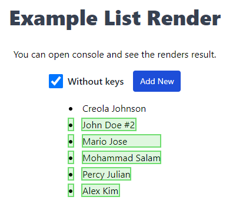

# Lists and Keys - React Key Concepts

To display multiple similar components from a data collection (lists), you should use [JavaScript array methods](https://developer.mozilla.org/en-US/docs/Web/JavaScript/Reference/Global_Objects/Array) such as `map` and `filter`.

For example, consider the following list:

```html
<ul>
  <li>Creola Katherine Johnson: mathematician</li>
  <li>Mario José Molina-Pasquel Henríquez: chemist</li>
  <li>Mohammad Abdus Salam: physicist</li>
  <li>Percy Lavon Julian: chemist</li>
  <li>Subrahmanyan Chandrasekhar: astrophysicist</li>
</ul>
```

💡 The only difference between the elements of this list is their content and data.

The following example demonstrates how to create a list of elements from an array using `Array.prototype.map()`:

```jsx
// Move data into an array
const people = [
  'Creola Katherine Johnson: mathematician',
  'Mario José Molina-Pasquel Henríquez: chemist',
  'Mohammad Abdus Salam: physicist',
  'Percy Lavon Julian: chemist',
  'Subrahmanyan Chandrasekhar: astrophysicist',
];

export const List = () => {
  // Create a new array of JSX elements (ReactNode) listItems
  const listItems = people.map((person) => <li>{person}</li>);

  // Return listItems from the component, wrapped in a <ul> tag
  return <ul>{listItems}</ul>;
};
```

When you run this code, you may see a warning in the console stating that each child in a list should have a unique "key" prop:

```diff
- Warning: Each child in a list should have a unique “key” prop.
```

This warning occurs because when attempting to render a collection inside a component, you need to add a key.

In React, a unique key is used to determine which components in the collection need to be re-rendered.

Imagine files on your desktop without names. Instead, you would refer to them by order - the first file, the second file, and so on. This can work, but once you delete a file, it leads to confusion. The second file becomes the first file, the third file becomes the second file, and so on.

File names in a folder and JSX keys in an array serve the same purpose. They allow us to uniquely identify an element among its siblings. A well-chosen key provides more information than position in the array. Even if the position changes due to order change, the key allows React to identify the element throughout its existence.

💡 Adding a unique key allows React to avoid re-rendering the entire collection every time an update occurs and only update the components that have actually changed.

### Where to Get Keys

Different data sources provide different sources of keys:

- If your data comes from a database, you should (must) use database keys/identifiers, which are unique by nature.
- If your data is generated and stored locally (e.g., notes in a note-taking app), use an incrementing counter, `crypto.randomUUID()`, or a package like `uuid` when creating elements.

### ⚠️ Rules for Keys

- Keys must be unique within a collection (array). However, you can use the same keys for JSX nodes in different arrays.
- Keys should not change, as this contradicts their purpose! Do not generate them during rendering.
- Avoid using the index of the array element as its key. Using such an index as a key often leads to subtle and confusing errors.

Instead of generating keys on the fly, you should include them in your data.

```jsx
// Array of data where each element contains a unique identifier (id)
const people = [
  {
    id: 1, // Used in JSX as a key
    name: 'Creola Katherine Johnson',
    profession: 'mathematician',
  },
  {
    id: 2, // Used in JSX as a key
    name: 'Mario José Molina-Pasquel Henríquez',
    profession: 'chemist',
  },
  {
    id: 3, // Used in JSX as a key
    name: 'Mohammad Abdus Salam',
    profession: 'physicist',
  },
  {
    id: 4, // Used in JSX as a key
    name: 'Percy Lavon Julian',
    profession: 'chemist',
  },
  {
    id: 5, // Used in JSX as a key
    name: 'Subrahmanyan Chandrasekhar',
    profession: 'astrophysicist',
  },
];

export const List = () => {
  // Create a list of multiple DOM nodes for each element
  const listItems = people.map(({ id, name, profession }) => (
    <Fragment key={id}>
      <h1>{name}</h1>
      <p>{profession}</p>
    </Fragment>
  ));

  // Return listItems from the component, wrapped in a <ul> tag
  return <ul>{listItems}</ul>;
};
```

Fragments disappear from the DOM, so a flat list `<h1>`, `<p>`, `<h1>`, `<p>`, and so on is created.

**[⬆ Back to Top](#lists-and-keys---react-key-concepts)**

A ready example with the application is located in `src`.



To run the example with the ready application, execute the following commands:

```shell
git clone https://github.com/shopot/react-101.git

git checkout rendering-lists

npm install

npm run dev
```

Documentation:

- 🔗 [Rendering Lists (react.dev)](https://react.dev/learn/rendering-lists)

**[⬆ Back to Top](#lists-and-keys---react-key-concepts)**
